# DC-DC参数计算

> 参考《精通开关电源设计 第2版》

## 概述和基本术语及基本参数(1.2章节)

- 效率的定义如下：
	- $$ \eta= \displaystyle\frac{P_{O}}{P_{in}} \tag{1.1} $$
	- $P_{O}$是输出功率，计算公式为：
		- $$ P_{O} = V_{O} \times I_{O} \tag{1.2} $$
	- $P_{IN}$是输入功率，计算公式为：
		- $$ P_{IN} = P_{IN} \times P_{IN} \tag{1.3} $$
	- $I_{IN}$是电源的平均输入电流或直流电流。
	- 变换器消耗的功率$P_{loss}$或损耗，简单处理后可得：
	- $$ P_{loss} = P_{IN} - P_{O} \tag{1.4} $$
		- 以输出功率表示为：
		- $$ P_{loss} = P_{O} \times \displaystyle\left(\frac{1-\eta}{\eta}\right) \tag{1.5} $$
		- 以输入功率表示为：
		- $$ P_{loss} = P_{IN} \times \displaystyle\left(1-\eta\right) \tag{1.6} $$
	- 现代开关电源的效率一般为65%-95%。

- LDO 是一种线性稳压器，使用在其饱和区域内运行的晶体管或场效应管（FET），从应用的输入电压中减去超额的电压，产生经过调节的输出电压。所谓压降电压，是指稳压器将输出电压维持在其额定值上下 100mV 之内所需的输入电压与输出电压差额的最小值。正输出电压的LDO（低压降）稳压器通常使用功率晶体管（也称为传递设备）作为 PNP。这种晶体管允许饱和，所以稳压器可以有一个非常低的压降电压，通常为 200mV 左右；与之相比，使用 NPN 复合电源晶体管的传统线性稳压器的压降为 2V 左右。

- BJT(双极型晶体管)
	- 开关速度慢
	- 价格低廉
	- 大驱动电流（流控型）
	- 低驱动电压（约0.8V）
	- 适合大电流设备，即使开关电流很大，正向导通压降也基本不变

- MOSFET(金属-氧化物半导体场效应晶体管)
	- 开关速度快
	- 价格稍高
	- 大部分需要>2V的驱动电压（压控型）

- IGBJ(绝缘栅型双极晶体管)
	- 压控型
	- 正向导通压降和开关速度与BJT类似

- 电抗元件
	- 电容(存在浪涌电流)
		- 静电能
		- $$ \frac{1}{2}CV^2 \tag{1.7} $$
		- 其中，C为电容量（单位为F），V为电容两端电压。
		- $$ C = \frac{Q}{V} \tag{1.8} $$
	- 电感(无损限流，可限制电流上升率)
		- 磁能
		- $$ \frac{1}{2}LI^2 \tag{1.9} $$
		- 其中，L为电感量（单位为H），I为（任意给定时刻）流过电感的电流。

- 寄生参数的影响
	- 电抗元件的温升总是源自元件与生俱来的小阻值寄生电阻产生的损耗
		- 电感
			- 非零直流电阻（DCR）
		- 电容
			- 等效串联电阻（ESR）
			- 等效串联电感（ESL）
	- 寄生参数有时有助于增强电路稳定性
		- DC-DC转换器的输出短路，电路的瞬时过载电流会因为寄生参数平缓许多。
		- 电压型控制转换器实际上依赖输出电容的等效串联电阻来包装环路稳定性，即使在正常工况下也是如此。
	- 寄生参数的有害作用
		- 寄生电感在开关导通时，限制开关电流尖峰，但在开关关闭时，因释放存储的磁能，回产生很高的电压尖峰。
		- 并联的寄生电容在开关关断时是有益的，吸收电压尖峰的能量，但在导通时是无益的，向开光管释放储存的静电能，产生电流尖峰。

- 高频开关问题
	- 温度
		- MOSFET的导通损耗随温度升高而增加；
		- BJT（在小电流工作时）的导通损耗随温度升高而减少；
		- 铝电解电容等效串联电的损耗随温度升高而减少；
		- 新型铁氧体材料的磁芯损耗呈倒钟形，在80°-90°附近出现最小值，沿两侧方向逐渐升高。
	- 频率
		- MOSFET的导通损耗和频率无关；
		- MOSFET的交叉损耗和随频率提高成比例增加；
		- 铝电解电容等效串联电的损耗随频率升高而减少；
	- 选择高开关频率的原因
		- 首要原因是让开关频率避开人类的听觉范围
		- 电感尺寸随开关频率提高成比例的减小
		- 频率的提高减小传导性电磁干扰滤波、输入、输出滤波元件的尺寸，包括电容

- 可靠性、使用寿命和热管理
	- 可靠性R定义为：
		- $$ R(t) = e^{-\lambda t}  \tag{1.10} $$
		- $\lambda$ 是电源失效率，即一段时间段内失效的电源数量
		- 平均无故障时间（MTBF），是整体失效率的倒数
			- $$ \lambda = 1/MTBF  \tag{1.11} $$
			- 典型商用电源在标准工况下和环境温度为25°时的平均无故障时间介于100000小时至500000小时之间。
	- 失效率随时间的变化，有一条著名的经验法则---温度每上升10°，整个电源的失效率加倍。
	- 电解电容内部电解液回随时间推移持续挥发，导致老化失效。推荐的铝电解电容使用寿命计算规则时：温度每升高10°，使用寿命减半。

- 应力降额
	- 温度降额系数70%
	- 电压降额系数80%
	- 电流降额系数70%-80%

---

## 电感(1.3章节)

- 电容充放电
	- 时间常数 $\tau = RC$；
	- 电容电压以指数$V_{IN}\times\left(1-e^{-t/\tau}\right) $增加；
	- 电容电流从最初的的最大值$\frac{V_{IN}}{R}$开始以指数规律$\frac{V_{IN}}{R}\times e^{-t/\tau}$衰减。

- 电感充放电
	- 时间常数 $\tau = L/R$；
	- 在开关导通阶段，电感电压以指数$V_{IN}\times\left(1-e^{-t/\tau}\right) $减小；
	- 电感电流从最初的的最小值0开始以指数规律$\frac{V_{IN}}{R}\times e^{-t/\tau}$增加。
		- $$ I(t) = \frac{V_{IN}}{R}\times\left(1-e^{-t/\tau}\right)  \tag{1.12} $$
		- $$ I(t) = \frac{V_{IN}}{R}\times\left(1-e^{-tR/L}\right)  \tag{1.13} $$
		- $$ \frac{I(t)}{dt} = \frac{V_{IN}}{R}\times\left(\frac{R}{L}e^{-tR/L}\right)  \tag{1.14} $$
		- $$ \frac{I(t)}{dt}|_{R=0} = \frac{V_{IN}}{L}  \tag{1.15} $$
	- 在上述推导中，因为R=0，所以电感电压敲好等于$V_{IN}$V_{IN}。但在一般情况下，如果用V表示任意给定时刻实际的电感电压，I为电感电流，可得到一般形式的电感方程：
		- $$ \frac{dI}{dt} = \frac{V}{L} \left(\text{电感方程}\right)  \tag{1.16} $$

- 对偶原理
	- 可证明以下两个方程必然成立：
		- $$ V = L\frac{dI}{dt} \left(\text{电感方程}\right)  \tag{1.16} $$
		- $$ I = C\frac{dV}{dt} \left(\text{电容方程}\right)  \tag{1.17} $$
	- 对应电感的恒压阶段和电容的恒流阶段，可根据给定时间段内直线段的增减量写出上述方程：
		- $$ V = L\frac{\Delta I}{\Delta t} \left(\text{恒压阶段的电感方程}\right)  \tag{1.18} $$
		- $$ I = C\frac{\Delta V}{\Delta t} \left(\text{恒流阶段的电容方程}\right)  \tag{1.19} $$
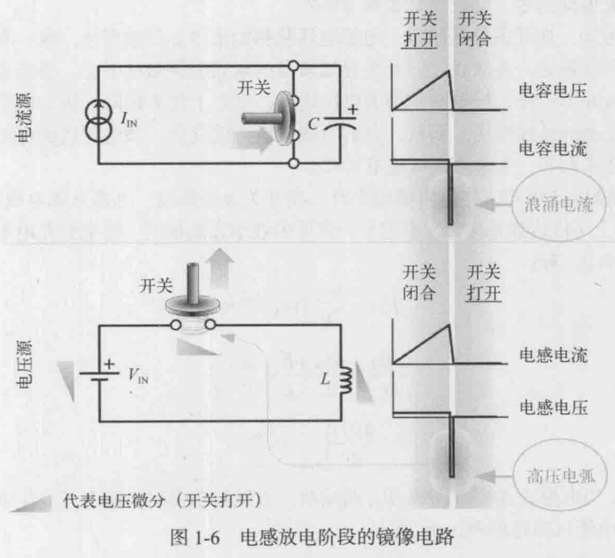

- 电容、电感的电压电流
	- 电容两端电压不能突变，可以以充放电的形式改变，电流可以突变
	- _**任何电感电流曲线都不能断续（不能突然跳变），因为电流断续意味着能量不连续**_，但是电流变化率（$ \frac {dI}{dt} $)是可以跳变的，可以从上升斜率跳变到下降斜率。
	- 电感电压反向的原因
		- 电流必须从电流源的正极流出，结合电感电流连续；
		- 未达到稳态时，开关时电感电压可以不反向；
		- 达到稳态时，每次开关转换时电感电压必然出现反向。

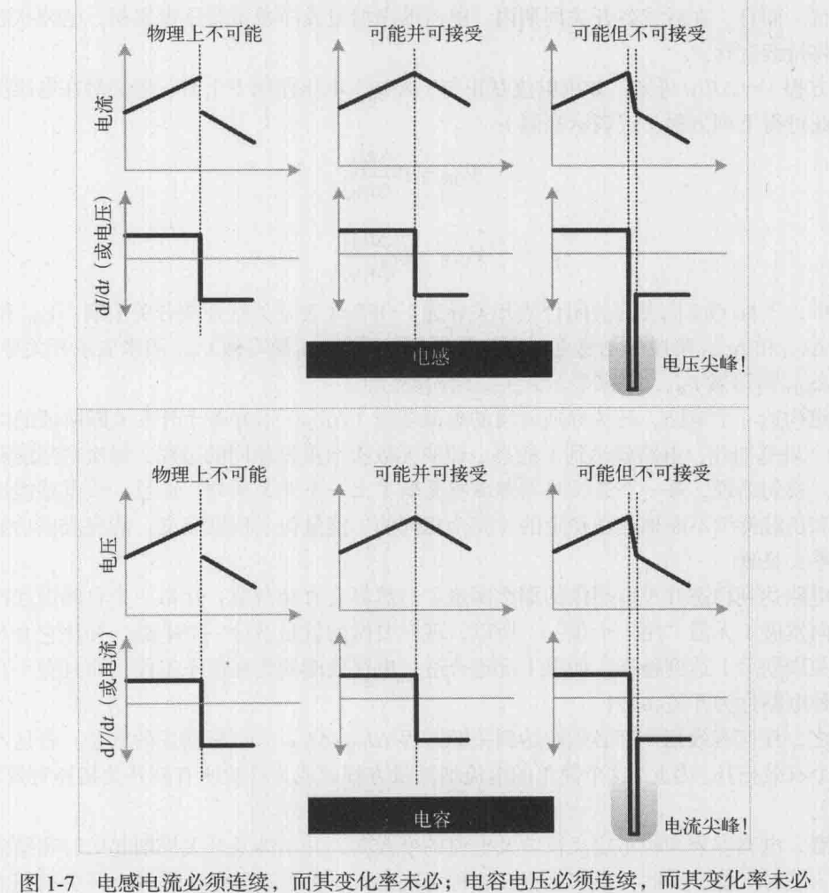

- 稳态
	- 电流回不到周期开始的初值，则电路状态无法稳定，从方程$ V = L\frac{\Delta I}{\Delta t} $，可得：
		- $$ V_{ON} = L\frac{\Delta I_{ON}}{\Delta t_{ON}}   \tag{1.20} $$
		- $$ V_{OFF} = L\frac{\Delta I_{OFF}}{\Delta t_{OFF}}   \tag{1.21} $$
		- 式中，下标ON代表开关闭合或开关导通，OFF代表开关打开或开关关断，$ V_{ON} $和$ V_{OFF} $分别对应$ t_{ON} $和$ t_{OFF} $阶段的电感电压。
	- 如果开关导通阶段的电流增量（$ \Delta I_{ON} $）恰好等于开关关断阶段的电流减量（$ \Delta I_{OFF} $），则说明电路达到了稳态。，任何有效拓扑都必须达到关键方程所描述的$ \Delta I_{ON} = \Delta I_{OFF} = \Delta I $状态，若达不到，就不是一个有效拓扑。
	- 电感方程和稳态定义仅涉及电流的增减量，并不涉及开关周期起始和结束时的电流真实（绝对）值。
		- 一种稳态时电流在每个开关周期内都回复到零，称为断续导通模式（DCM）
		- 另一种稳态是电流无论如何变化，其值始终大于零，称为连续导通模式（CCM）
		- 介于两种模式临界点称为临界导通模式（BCM）
	- 在任何情况下，平均电感电流（$ I_{AVG} $或$ I_{L} $）都与负载电流（$ I_{O} $）成正比。
	- 一般通过降低负载电流，变换器可以从连续导通模式自动切换到断续导通模式。
	- 除了连续导通模式外，平均电感电流（$ I_{AVG} $）是所有电流波形斜波部分的几何中心。
	- 汽车模拟法是认识平均电感电流（$ I_{AVG} $）的一个好方法。
	- 始终工作在临界导通模式下的变换器都是变频工作，失去了定频工作的所有优势。
	- 同步拓扑有强迫脉宽调制模式（FPWM）或强迫连续导通模式（FCCM），连续导通模式下的（非同步拓扑）标准设计方程几乎都适用于强迫连续导通模式。

- 伏秒定律、电感复位和变换器的占空比
	- 电感电压与作用时间的乘积称为伏秒积
		- 可用电感方程$ V = L\frac{\Delta I}{\Delta t} $来描述稳态，稳态时，有$ \Delta I_{ON} = \Delta I_{OFF} = \Delta I $，所以：
			- $$ \begin{cases} V_{ON} = L\frac{\Delta I_{ON}}{\Delta t_{ON}} \\ V_{OFF} = L\frac{\Delta I_{OFF}}{\Delta t_{OFF}}  \\  \Delta I_{ON} = \Delta I_{OFF} = \Delta I  \end{cases} \tag{1.21}$$
		- 得：
			- $$ V_{ON}\times t_{ON} = V_{OFF}\times t_{OFF} \tag{1.22}$$
		- 开关导通（及电流上升阶段）伏秒积的幅值必然等于开关关断（及电流下降阶段）伏秒积的幅值，但符号相反。
		- 开关导通阶段电压曲线的面积必然等于开关关断阶段电压曲线的面积。
	- 现代开关功率变换所涉及的时间尺度一般都很小，所以伏秒积是一个非常小的数值，为了便于处理，经常使用$ E_{t} $或伏微秒积。$ E_{t} $显然是电感电压与微妙级（而非秒级）时间的乘积。
		- $$ \Delta I_{ON} = \frac{V_{ON} \times t_{ON}}{L} = \frac{V_{ON} \times t_{ON\_ \mu H}}{L}  \tag{1.23} $$
	- 简化为：
		- $$ \Delta I = \frac{E_{t}}{L} \left(\text{稳态，L的单位是uH}\right) \tag{1.24} $$
	- 当以开关频率$ f $重复动作是，周期（$ T $）等于$ 1/f $。功率变换器的占空比（）定义为开关的导通时间与开关周期之比，因此有：
		- $$ D = \frac{t_{ON}}{T}  \tag{1.25} $$
		- 也可写作：
		- - $$ D = \frac{t_{ON}}{t_{ON}+(T-t_{ON})}  \tag{1.25} $$

## 开关拓扑的演变(1.4章节)

- 通过开关管续流控制感应电压尖峰
	- 电感两端的电压可以突变

- 增加电容进行充放电，获得直流输出电压
	- 二极管（续流）电流降向电容充电，电容电压有望达到稳态电压$ V_{O} $,由于开关关断阶段电感电压增加，所以电感电流下降率也随之增加；电容在每个周期充电，但其电流下降率逐渐增加，最终使变换器自然达到平衡状态，即满足基本条件$ \Delta I_{ON} = \Delta I_{OFF} = \Delta I $，而且变换器一旦达到稳态，就能自我保持。

- 升降压变换器
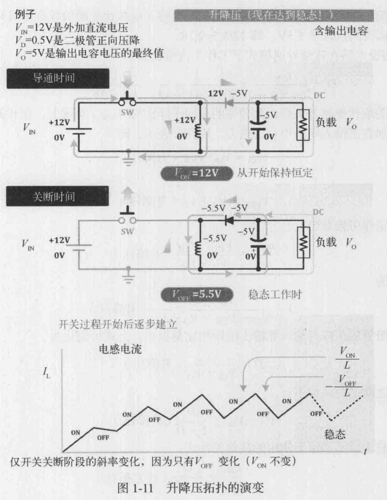
	- 逆向思维，假设变换器已经达到稳态，输出电容电压为5V。进行分析：
		- 电感电流上升段斜率固定，为$ \frac{V_{IN}}{L} $；
		- 电感电流下降段初始斜率为$ \frac{V_{D}}{L} $，初始时$ \Delta I_{ON} > \Delta I_{OFF} $，因此，电流开始阶梯式上升，但电容充电后，电流下降阶段的斜率以及$ \Delta I_{OFF} $变得越来越大，最终电路达到稳态，符合$ \Delta I_{ON} = \Delta I_{OFF} = \Delta I $定义。应用伏秒定律，有：
			- $$ V_{ON}\times t_{ON} = V_{OFF}\times t_{OFF} \tag{1.29} $$
		- 代入数值得：
			- $$ 12\times t_{ON} = 5.5\times t_{OFF} \tag{1.30} $$
		- 只要开关的导通时间与关断时间之比固定，就会得到固定5V输出。即
			- $$ \frac{t_{OFF}}{t_{ON}} = \frac{12}{5.5} = 2.18 \tag{1.31} $$
		- 假设电路工作在连续导通模式，占空比为：
			- $$ D = \frac{t_{ON}}{t_{ON}+t_{OFF}} = \frac{1}{1+\frac{t_{OFF}}{t_{ON}}} = \frac{1}{1+2.18} = 0.314 \tag{1.32} $$
		- 半导体取代机械开关后，其非零的正向压降记为$ V_{SW} $。实际上，在开关导通阶段，正向压降可从外加直流输入电压中直接减去。用符号表示，即
			- $$ V_{ON} = V_{IN}-V_{SW} \left(\text{升降压}\right) \tag{1.33} $$
		- 和
			- $$ V_{OFF} = V_{O}+V_{D} \left(\text{升降压}\right) \tag{1.34} $$
		- 那么，由伏秒定律可推导出
			- $$ \frac{t_{OFF}}{t_{ON}} = \frac{V_{IN}-V_{SW}}{V_{O}+V_{D}} \left(\text{升降压}\right) \tag{1.35} $$
		- 所以，占空比为
			- $$ D = \frac{V_{O}+V_{D}}{V_{IN}-V_{SW}+V_{O}+V_{D}} \left(\text{升降压}\right) \tag{1.36} $$
		- 如果开关管的压降与输入和输出电压相比都很小，上式可以简化为
			- $$ D \approx \frac{V_{O}}{V_{IN}+V_{O}} \left(\text{升降压}\right) \tag{1.37}  $$
		- 则输入与输出之间的关系如下：
			- $$ V_{O} = V_{IN} \times \frac{D}{1-D} \left(\text{升降压}\right) \tag{1.38} $$
		- 推导出一些便于使用的其他关系式：
			- $$ \frac{t_{ON}}{t_{OFF}} = \frac{D}{1-D} \left(\text{任意拓扑}\right) \tag{1.39} $$
			- $$ {t_{ON} = \frac{D}{f}} \left(\text{任意拓扑}\right) \tag{1.40} $$
			- $$ {t_{OFF} = \frac{1-D}{f}} \equiv \frac{D^{'}}{f} \left(\text{任意拓扑}\right) \tag{1.41} $$
			- 式中$ D^{'} = 1-D $，她定义为二极管的占空比，因为（在连续导通模式下）二极管在开关周期的剩余时间内导通。

- 电路的地参考点
	- 直流输入电压通过两条导线外加在电路上，类似的，输出也有两条导线，在实际拓扑中，一般会有一条导线是输入和输出公用的，在DC-DC变换器中，这条公共导线习惯上称作系统的地。
拓扑的两种电路结构.png)

- 交换节点
	- 电感电流绕行之处，即二极管和开关之间的节点，称为交换节点。电流从电感流入节点后，既可以从二极管流出，也可以用开关流出，这取决于开关状态。每一个DC-DC开关拓扑都有此节点（若无，则会出现巨大的电压尖峰）。
	- 若示波器探头连接至此（探头地线连接到电源地，即0V处），观察到的电压波形始终是斩波式的。实际上，它非常类似于电感电压，只是不同拓扑有不同的直流偏移量。
	- **设计印制电路板时必须注意，叫唤节点处不要辐射太多的铜，否则，会形成有效的电场天线，向四周喷射放射状的射频干扰。而且，输出导线可能会拾取该辐射噪声并直接传递给负载。**

- 升降压变换器分析
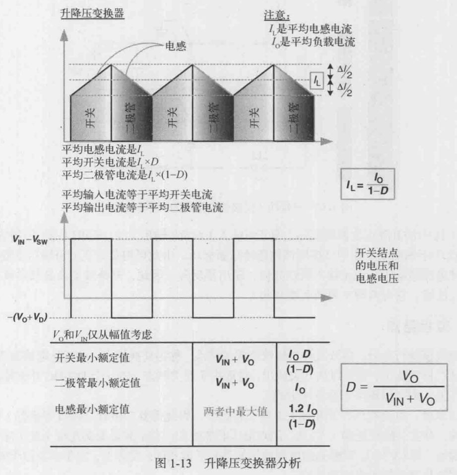
	- 经由稳态电流斜波部分的几何中心，能画出一条$ I_{L} $线，它定有为平均电感电流。在$ t_{ON} $时间段内，平均开关电流也等于$ I_{L} $，类似的，在在$ t_{OFF} $时间段内，平均二极管电流也等于$ I_{L} $。然后，由简单的数学计算可知，若在全周期内（即包含开关导通阶段和开关关断阶段）进行平均，则开关和二极管的平均电流应该时他们各自的加权平均值。
		- $$ I_{SW\_AVG} = I_{L} \times \frac{t_{ON}}{T} = I_{L} \times D \left(\text{升降压}\right) \tag{1.42} $$
		- $$ I_{D\_AVG} = I_{L} \times \frac{t_{OFF}}{T} = I_{L} \times D^{'} = I_{L} \times (1-D) \left(\text{升降压}\right) \tag{1.43} $$
		- **上述公式可以这样理解：开关电流只在$ t_{ON} $时间段有，在$ t_{OFF} $时间段为0，所以在整个周期$ T $，可以这样算$ I_{SW\_AVG} $。**
			- $$ I_{SW\_AVG} = \frac{I_{L} \times t_{ON} + 0  \times t_{OFF}}{T} $$
	- 因为升降压拓扑在开关导通时，输入端给变换器提供电流，所以平均输入电流等于平均开关电流。
	- 平均二极管电流等于负载电流，后续会说明推导过程。

- 升降压变换器特性
	- 开关导通时，能量从输入直流电源（通过开关）传输给电感，没有能量传输到输出端。
	- 开关关断时，电感储能（通过二极管）传输到输出端，没有直接来自输入电源的能量。
	- 基于以上两点，升降压拓扑大概是唯一的纯反激拓扑，所有从输入传输到输出的能量必须先储存字电感中。
	- 输入电容（直流源）电流是斩波式的，即脉动的。该电流与直流电源输出的稳定电流（$ I_{IN} $）叠加构成开关电流（它在所有拓扑中都是斩波式的）（参考图1-9）。

	- 类似的，输出电容电流也是斩波式的，它与稳定负载电流叠加构成二极管电流（它在所有拓扑中都是斩波式的）。
	- 发热量与电流有效值（RMS）的平方成正比，由于斩波式波形的有效值较大，升降压变换器的效率并不是而很高，而且，电路板上的噪声和纹波通常也比较大。通常需要在升降压变换器的输入和输出端外加滤波器。
	- 虽然输出电容在开关关断时充电，在开关导通时放电，但平均电流始终为零。事实上，根据定义，稳态时的平均电流必须为零，否则电容或充或放，直至达到稳态，就像电感电流一样。
		- 既然输出电容的平均电流为零，那么升降压变换器的平均二极管电流必然等于负载电流（否则电流从哪里来？），因此有：
			- $$ I_{D\_AVG} = I_{O}  = I_{L} \times (1-D) \left(\text{升降压}\right) \tag{1.44} $$
			- 即有
			- $$ I_{L}  = \frac {I_{O}}{1-D} \left(\text{升降压}\right) \tag{1.45} $$
	- 电感电流额定值为$ 1.2 \times \frac {I_{O}}{1-D} $。系数1.2符合一般设计准则，即电感电流波形的峰值比起平均值高出大约20%。因此，要求电感电流额定值至少是$ 1.2 \times I_{L} $。

- 为什么仅有三种基本拓扑
	- 有多种方法来构造既含有电感，又能为电感电流提供续流回路的拓扑，但一些拓扑的输入和输出之间并没有公用导线，即变换器与系统的其他部分之间没有适合的地参考点，因此是不实用的。
	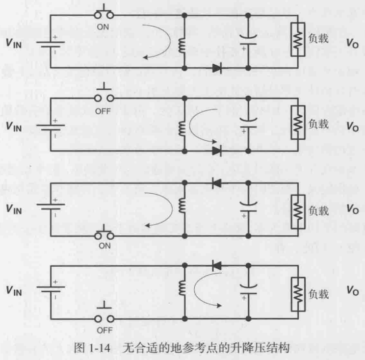
	- 归因于电感的连接方式
		- 只有三种连接方式具有合适的地参考点，即电感连接到输入端，输出端和（公共）地。
			- 电感连接到地：升降压变换器
			- 电感连接到输入端：升压变换器
			- 电感连接到输出端：升降压变换器

- 升压拓扑
升压拓扑和降压拓扑.png)

	- 在升压变换器中，开关导通时，能量从输入直流电源（通过开关）传输给电感，没有能量输出到输出端。
	- 开关关断时，电感储能（通过二极管）输出到输出，同时，输出中有一部分能量直接来自输入直流电源。
	- 输入电容（直流源）电流是“平滑”的，因为输入电容与电感串联（电感可防止电流跳变）。
	- 但输出电容电流是斩波式的，因为它与稳定的负载电流（$ I_{OUT} $）叠加构成二极管电流（它在所有拓扑中都是斩波式的）。（参考图1-9)
	- 既然输出电容的平均电流为零，那么升压变换器的平均二极管电流必然等于负载电流（否则电流从哪里来的呢？）因此，有
		- $$ I_{D\_AVG} = I_{O} = I_{L} \times (1-D) \tag{1.46} $$
		- 所以有
		- $$ I_{L} = \frac{I_{O}}{1-D} \left(\text{升压}\right) \tag{1.47} $$
		- 这就是平均电感电流和负载电流的关系式，电感电流额定值为$ 1.2 \times \frac{I_{O}}{(1-D)} $。
	- 稳态时，分析升压拓扑，有
		- $$ V_{ON} = V_{IN}-V_{SW} \left(\text{升压}\right) \tag{1.48} $$
		- 和
			- $$ V_{OFF} = V_{O}+V_{D}-V_{IN} \left(\text{升压}\right) \tag{1.49} $$
		- 那么，由伏秒定律可推导出
			- $$ \frac{t_{OFF}}{t_{ON}} = \frac{V_{IN}-V_{SW}}{V_{O}+V_{D}-V_{IN}} \left(\text{升压}\right) \tag{1.50} $$
		- 对上式进行代数运算，消去$ t_{OFF} $,得
			- $$ \frac{t_{OFF}}{t_{ON}}+1 = \frac{V_{IN}-V_{SW}}{V_{O}+V_{D}-V_{IN}}+1 \tag{1.51} $$
			- $$ \frac{t_{OFF}+t_{ON}}{t_{ON}} = \frac{V_{IN}-V_{SW}+V_{O}+V_{D}-V_{IN}}{V_{O}+V_{D}-V_{IN}} \tag{1.52} $$
		- 变换器得占空比$ D $定义为
			- $$ D = \frac{t_{ON}}{T} \left(\text{任意拓扑}\right) \tag{1.53} $$
		- 对于连续导通模式，有$ T=t_{ON}+t_{OFF} $所以，占空比为
			- $$ D = \frac{V_{O}+V_{D}-V_{IN}}{V_{O}+V_{D}-V_{SW}} \left(\text{升压}\right) \tag{1.54} $$
		- 如果开关管的压降与输入和输出电压相比都很小，上式可以简化为
			- $$ D \approx \frac{V_{O}-V_{IN}}{V_{O}} \left(\text{升压}\right) \tag{1.55}  $$
		- 则输入与输出之间的关系如下：
			- $$ V_{O} = V_{IN} \times \frac{1}{1-D} \left(\text{升压}\right) \tag{1.56} $$

- 降压拓扑
升压拓扑和降压拓扑.png)
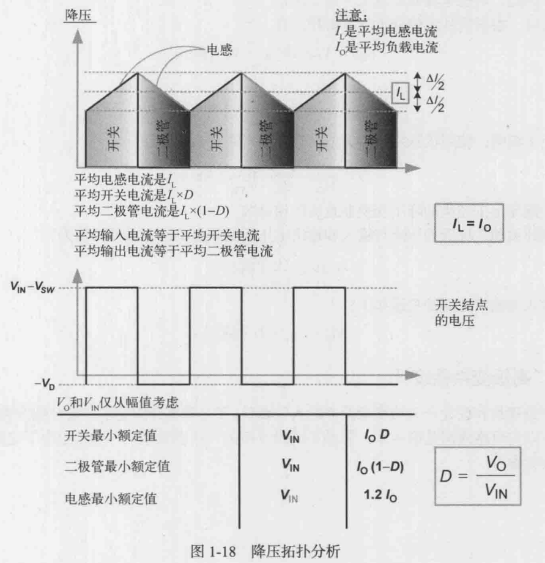
	- 在降压变换器中，开关导通时，能量从输入直流电源（通过开关）传输给电感，同时有一部分能量输出到输出端。
	- 开关关断时，电感储能（通过二极管）输出到输出，没有能量来自输入直流电源。
	- 输入电容（直流源）电流是斩波式的，该电流与直流电源输出得稳定直流（$ I_{IN} $）叠加构成开关电流（它在所有拓扑中都是斩波式的）。（参考图1-9)
	- 输出电容（直流源）电流时“平滑”的，因为输出电容与电感串联（电感可防止电流跳变）。
	- 既然输出电容的平均电流为零，那么升压变换器的平均电感电流必然等于负载电流（否则电流从哪里来的呢？）因此，有
		- $$ I_{L} = I_{O} \left(\text{降压}\right) \tag{1.57} $$
		- 这就是平均电感电流和负载电流的关系式，电感电流额定值为$ 1.2 \times I_{L} $。
	- 稳态时，分析升压拓扑，有
		- $$ V_{ON} = V_{IN}-V_{SW}-V_{O} \left(\text{降压}\right) \tag{1.58} $$
		- 和
			- $$ V_{OFF} = V_{O}-(-V_{D}) = V_{O}+V_{D} \left(\text{降压}\right) \tag{1.59} $$
		- 与上文相同，使用伏秒定律并加以简化，可推导出
			- $$ D = \frac{V_{O}+V_{D}}{V_{IN}+V_{D}-V_{SW}} \left(\text{降压}\right) \tag{1.60} $$
		- 如果开关管的压降与输入和输出电压相比都很小，上式可以简化为
			- $$ D \approx \frac{V_{O}}{V_{IN}} \left(\text{降压}\right) \tag{1.61}  $$
		- 则输入与输出之间的关系如下：
			- $$ V_{O} = V_{IN} \times D \left(\text{降压}\right) \tag{1.62} $$

## DC-DC变换器及其磁性元件设计(第二章)

- 在选择功率器件是，通常需要考虑最恶劣情况下可能承受的应力。

- 直流传递函数
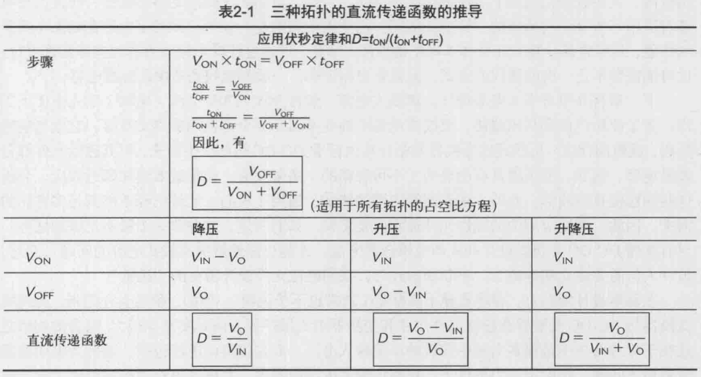
	- $$ \frac{t_{OFF}}{t_{ON}} = \frac{V_{ON}}{V_{OFF}} \left(\text{任意拓扑}\right) $$
	- $$ \frac{t_{OFF}}{t_{ON}}+1 = \frac{V_{ON}}{V_{OFF}}+1 \left(\text{任意拓扑}\right) $$
	- $$ \frac{t_{ON}}{t_{ON}+t_{OFF}} = \frac{V_{OFF}}{V_{OFF}+V_{ON}} \left(\text{任意拓扑}\right) $$
	- $$ D = \frac{V_{OFF}}{V_{OFF}+V_{ON}} \left(\text{任意拓扑}\right) $$

- 电感电流波形中的直流分量和交流纹波
	- 由$ V = L \frac{dI}{dt} $可得$ \Delta I = V\frac{\Delta t}{L} $。因此，电感的交流纹波完全由伏秒积和电感值决定。
		- 伏秒积取决于输入/输出电压（即占空比）、时间和开关频率。因此，只有改变$ L $、$ f $或$ D $才能影响$ \Delta I $，别无其他可能。
		- 由下表可知，改变负载电流$ I_{O} $对$ \Delta I $没有影响，即实际上不会影响电感电流纹波。$ I_{O} $与平均电感电流成正比。
	- 除了电流纹波$ \Delta I $外，电感电流波形中还有另一个（独立的）分量，即（平均）直流分量$ I_{DC} $。它定义为一个电平，电流纹波$ \Delta I $以它为中心对称分布，即$ \frac {\Delta I}{2} $在$ I_{DC} $上方，$ \frac {\Delta I}{2} $在$ I_{DC} $下方。$ I_{DC} $的大小仅取决于能量流的需求，即能量流的平均流量要与输入/输出电压以及预期的输出功率相匹配。特别的，
		- 改变电感值$ L $不会影响$ I_{DC} $；
		- 改变电感值$ f $不会影响$ I_{DC} $；
		- 改变电感值$ D $不会影响$ I_{DC} $；
		- 可参考下列方程来理解：
			- $$ I_{DC} = I_{O} \left(\text{降压}\right) \tag{2.1} $$
			- $$ I_{DC} = \frac{I_{O}}{1-D} \left(\text{升压和升降压}\right) \tag{2.2} $$

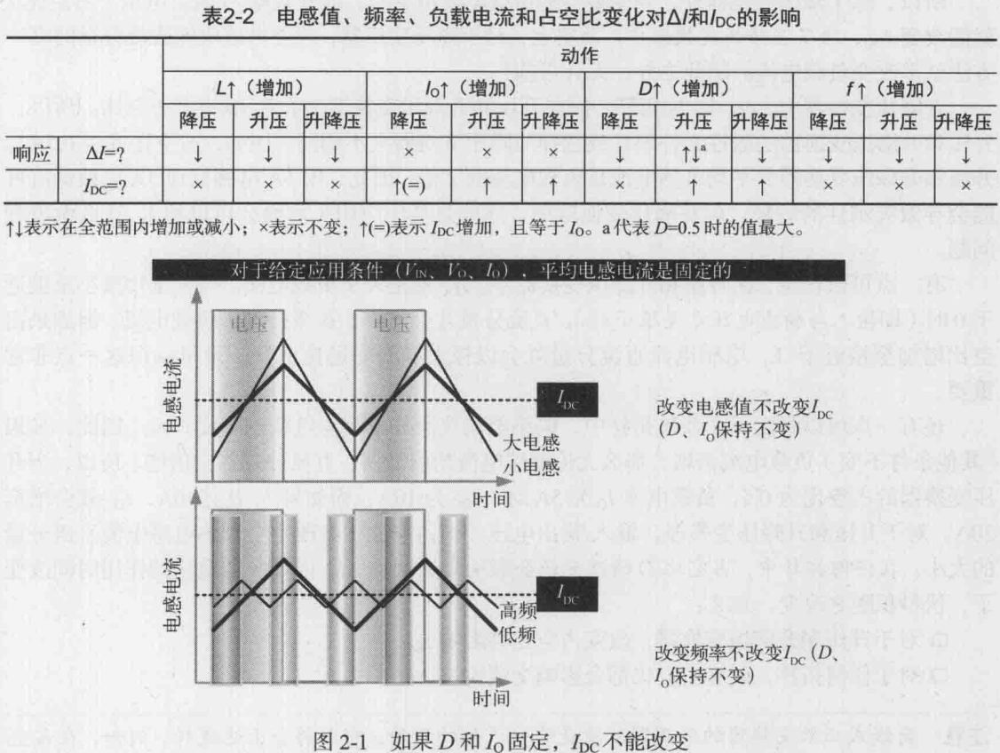

- 交流电流，直流电流和峰值电流的定义
	- 电感电流的交流值定义为
		- $$ I_{AC} = \frac{\Delta I}{2} \tag{2.3} $$
	- 电流纹波率$ r $是一个关键参数，他把两个原本相互独立的电流分量$ I_{DC} $和$ \Delta I $联系起来。在所有变换器设计中，都必须把$ r $设置为最优就够了。 **$ r $值一般在0.3-0.5之间，并且它与特定工况，开关频率，甚至拓扑本身无关。** 在实际设计中，它一般按经验取值，$ r $值会影响所有功率器件的电流应力和损耗，进而影响功率器件的选择。因此，几乎所有的功率变换器的设计都从设置$ r $值开始。
	- 直流分量影响绕组的$ I^2 R $损耗（铜损），交流分量$ \Delta I $影响磁芯损耗。
	- 峰值电流
		- $$ I_{PK} = I_{DC}+I_{AC} \tag{2.4} $$
	- 电感电流达到峰值时，磁场强度也会达到峰值，如果电感内部的磁场强超过某一安全值，电感就会饱和（失去电感值），该值取决于电感实际使用的磁芯材料本身（与其几何形状、线圈匝数、甚至气隙大小无关）。
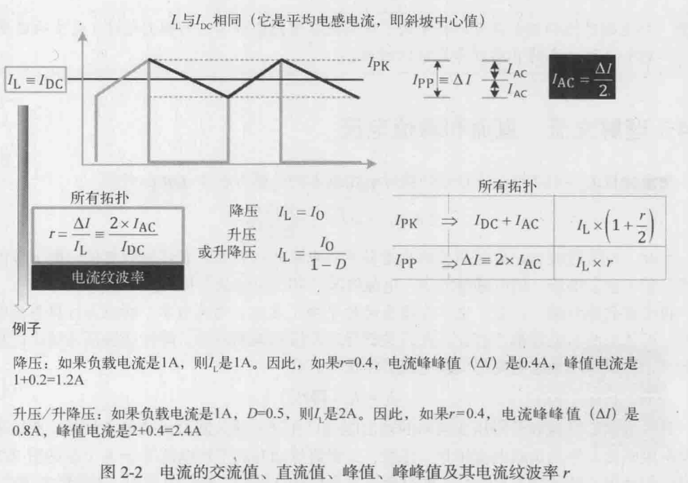

- 理解交流、直流和峰值电流
	- 交流分量$ I_{AC} = \frac{\Delta I}{2} $可由伏秒定律推导。由基本的电感方程$V = L\frac{dI}{dt} $可得
		- $$ 2 \times I_{AC} = \Delta I= \frac{\text{伏秒积}}{\text{电感值}} \tag{2.5} $$
		- 因此，电流纹波$ I_{PP} \equiv \Delta I $可以直观地看作单位电感的伏秒积。
	- 在开关导通阶段和关断阶段，降压变换器的输出能量都流经电感，所以平均电感电流和负载电流必然相等。有
		- $$ I_{L} = I_{O} \left(\text{降压}\right) \tag{2.6} $$
	- 升压和升降压变换器的输出能量只在开关关断阶段流经二极管，所以平均二极管电流必然与平均负载电流相等，可得
		- $$ I_{D} = I_{L} \times (1-D) = I_{O}  \tag{2.7} $$
		- $$ I_{L} = \frac {I_{O}}{1-D} \left(\text{升压和升降压}\right) \tag{2.8} $$
	- **注意：对于任何拓扑，大占空比都对应低输入电压，小占空比都对应高输入电压，因此，在任何情况下，增加占空比实际上都意味着输入电压（幅值）降低。** 如果升压和升降压变换器的输入和输出压差很大，那么直流电感电流就很大。
	- 由已知的直流和交流分量，可用下式计算出峰值电流
		- $$ I_{PK} = I_{DC}+I_{AC} = \frac{\Delta I}{2} + I_{L} \tag{2.9} $$
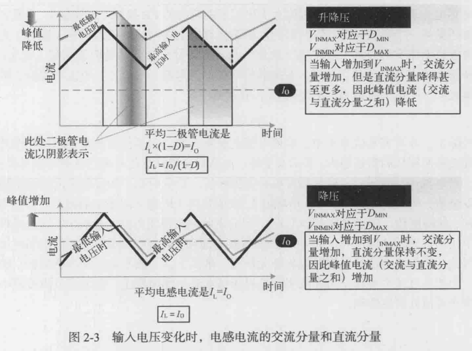

- 定义“最恶劣”输入电压
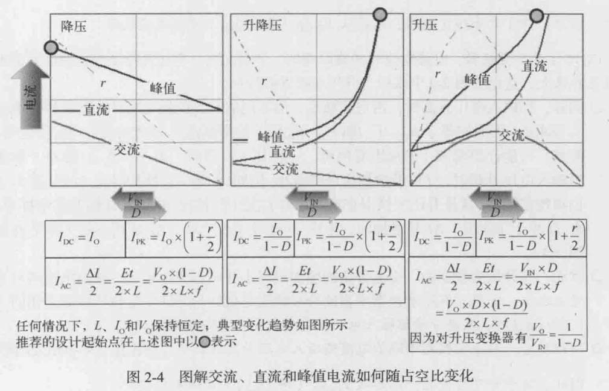
	- 对于降压变换器，电感电流分析如下：
		- 输入电压升高时，占空比减小以维持正常调节。但电流斜坡的下降率$\frac{\Delta I}{I_{OFF}}$并未改变，因为若$V_{O}$固定，它等于$\frac{V_{OFF}}{L}$，即$\frac{V_{O}}{L}$。但现在$t_{OFF}$增加了，而斜率$\frac{\Delta I}{I_{OFF}}$不变，唯一的可能就是必然$\Delta I$（成比例）增加。因此可以断定：降压变换器中，电感电流交流分量实际上随着输入电压升高而增加。
		- 另一方面，电流斜波中心值$I_{L}$稳定在$I_{O}$，所以直流分量未变。
		- 最后，由于峰值电流是直流分量和交流分量之和，所以它随着输入电压升高而增加。
		- 因此，对于降压变换器，总是优先从$V_{INMAX}$（$D_{MIN}$）开始电感设计。
	- 对于升降压变换器，电感电流分析如下：
		- 输入电压升高时，占空比减小以维持正常调节。但电流斜坡的下降率$\frac{\Delta I}{I_{OFF}}$并未改变，因为若$V_{O}$固定，它等于$\frac{V_{OFF}}{L}$，即$\frac{V_{O}}{L}$（与降压变换器相同）。但现在$t_{OFF}$增加了，而斜率$\frac{\Delta I}{I_{OFF}}$不变，唯一的可能就是必然$\Delta I$（成比例）增加。因为满足$V_{OFF} = V_{O}$。
		- 另一方面，$ I_{L} = \frac {I_{O}}{1-D} $，电流斜波中心值$I_{L}$随着电压升高，占空比减小，$I_{L}$增大。
		- 最后，由于峰值电流是直流分量和交流分量之和
			- $$ \begin{aligned} I_{PK} &=I_{DC}+I_{AC} \\ &=I_{L} + \frac{\Delta I}{2} \\ &=\frac{I_{O}}{1-D} + \frac{Et}{2 \times L} \\ &=\frac{I_{O}}{1-D} + \frac{V_{O} \times (1-D)}{2 \times L \times f} \\ \end{aligned} $$
			- 求导得(常数可以忽略)
			- $$ \begin{aligned} I_{PK}' &=(\frac{I_{O}}{1-D})' + (\frac{V_{O} \times (1-D)}{2 \times L \times f})' \\ &=(\frac{1}{1-D})' + (1-D)' \\ &=\frac{1}{(1-D)^2} -1 \\ \end{aligned} $$
				- 因为$ 0<D<1 $,所以$ I_{PK}' > 0 $, $ I_{PK} $对D单调递增，但D对Vin单调递减，所以$ I_{PK} $对Vin单调递减，所以峰值电流随着输入电压升高而减小。
		- 因此，对于升降压变换器，总是优先从$V_{INMIN}$（$D_{MAX}$）开始电感设计。
	- 对于升压变换器，电感电流分析如下：
		- 输入电压升高时，占空比减小以维持正常调节。但电流斜坡的下降率$\frac{\Delta I}{I_{OFF}}$必须减小，因为它等于$\frac{V_{OFF}}{L}$，即$\frac{V_{O}-V_{IN}}{L}$（仅指幅值）。斜率减小有两个原因：$t_{OFF}$增加和$\Delta I$ 减小。如果$t_{OFF}$增加得比$\Delta I$快，那么$\frac{\Delta I}{I_{OFF}}仍将按需减小。经过数学推导可知，当D小于0.5时，$\Delta I$是增加的，但在D超过0.5之后，$\Delta I$是减小的。
		- 然而，在升压变换器中，交流分量的增加或减小并不占主导地位，峰值电流只有直流分量来决定。升压变换器中直流分量的变化规律与升降压变换器中完全相同，直流分量随输入电压升高而减小（占空比减小）。
			- $$ \begin{aligned} I_{PK} &=I_{DC}+I_{AC} \\ &=I_{L} + \frac{\Delta I}{2} \\ &=\frac{I_{O}}{1-D} + \frac{Et}{2 \times L} \\ &=\frac{I_{O}}{1-D} + \frac{V_{O} \times D \times (1-D)}{2 \times L \times f} \\ \end{aligned} $$
			- 求导得(常数可以忽略)
			- $$ \begin{aligned} I_{PK}' &=(\frac{I_{O}}{1-D})' + (\frac{V_{O} \times D \times (1-D)}{2 \times L \times f})' \\ &=(\frac{1}{1-D})' + (D \times (1-D))' \\ &=\frac{1}{(1-D)^2} +1 -2D \\ \end{aligned} $$
				- 假设$ I_{PK}' > 0 $,则
				- $$  \frac{1}{(1-D)^2} +1 -2D > 0 $$
				- $$  \frac{1}{(1-D)^2} > 1 -2 \times(1-D) $$
				- 因为$ 0<D<1 $,所以$ \frac{1}{(1-D)^2} > 1 $且$ 1 - 2 \times(1-D) < 1$，假设成立。
				- $ I_{PK}' > 0 $, $ I_{PK} $对D单调递增，但D对Vin单调递减，所以$ I_{PK} $对Vin单调递减。
		- 所以，升压变换器峰值电流随着输入电压升高而减小。
		- 因此，对于升压变换器，总是优先从$V_{INMIN}$（$D_{MAX}$）开始电感设计。

- 电流纹波率$r$
	- 电流纹波率$r$是一个最基本、但影响深远得电源设计参数。表示电感电流得交流分量与直流分量的几何比例。
		- $$ r = \frac{\Delta I}{I_{L}} = 2 \times \frac{I_{AC}}{I_{DC}} \tag{2.10} $$ 
		- 一旦（最大负载电流和最恶劣输入电压下）的$r$值设定，其他的所有参数几乎都能确定，如输入输出电容电流、开关管电流的有效值（均方根值）等。因此，$r$值选择影响器件选择和器件成本，一定要清晰理解，仔细选择。
	- **注意，电流纹波率$r$仅适用于连续导通模式，有效取值范围为0-2。当$r$为0时，$\Delta I$必然为0。由电感方程可知，电感将非常大（无穷大）。显然，$r=0$并非实用值。若$r=2$，则变换器工作在临界导通模式（$I_{AC}=I_{DC}$。**
	- **注意，电流纹波率$r$有效取值范围为0-2。当$r$为0时，但也有例外，如强迫连续导通模式。**
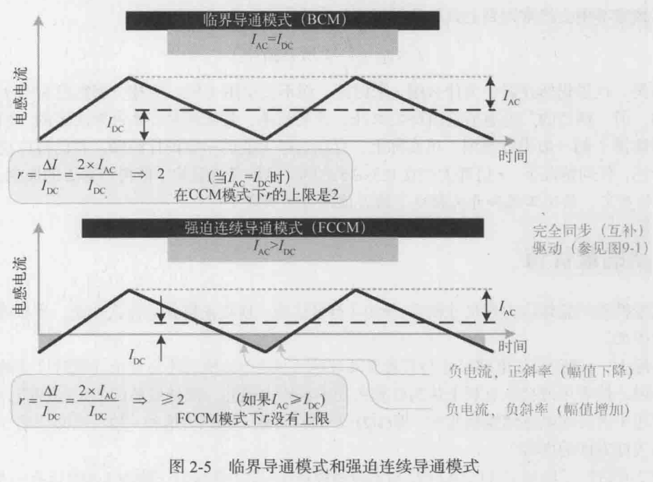

- $r$与电感值的关系
	- $$ \Delta I = \frac{Et}{L_{\mu H}} \left(\text{所有拓扑}\right) \tag{2.11} $$ 
	- $$ r = \frac{\Delta I}{I_{L}} = \frac{Et}{L_{\mu H} \times I_{L}} \left(\text{所有拓扑}\right) \tag{2.12} $$ 
	- 可得
		- $$ r = \frac{Et}{L \times I_{L}} = \frac{V_{ON} \times D}{(L \times I_{L}) \times f} = \frac{V_{OFF} \times (1-D)}{(L \times I_{L}) \times f} \left(\text{所有拓扑}\right) \tag{2.13} $$ 
		- 仅适用于连续导通模式，因为式中$ t_{OFF} $假定表示完整的开关管关断阶段，即$ \frac{(1-D)}{f} $。
	- 反之，$L$是$r$的函数
		- $$ L = \frac{V_{ON} \times D}{r \times I_{L} \times f} \left(\text{所有拓扑}\right) \tag{2.14} $$ 
		- 后续会经常用到上式的简易形式，称作$L \times I$方程
			- $$ L  \times I_{L} = \frac{Et}{r} \left(\text{所有拓扑}\right) \tag{2.15} $$ 
		- 为什么使用$r$来讨论，而不直接用$L$呢？上述方程虽已表明$L$和$r$是相关的，但“期望的”电感值是由特定工况、开关频率、甚至是拓扑本身来决定的。因此，无法给出选择$ L $的一般设计规则。可实际上，存在选择$ r $值得一般设计经验，并已被广泛应用。如前所述，任何情况下，$ r $值一般在0.3-0.5之间。这就是先设定$ r $值再计算$ L $得原因。当然，一旦$ r $值确定，给定工况和开关频率下的$ L $值就自动确定了。

- $r$的最优值
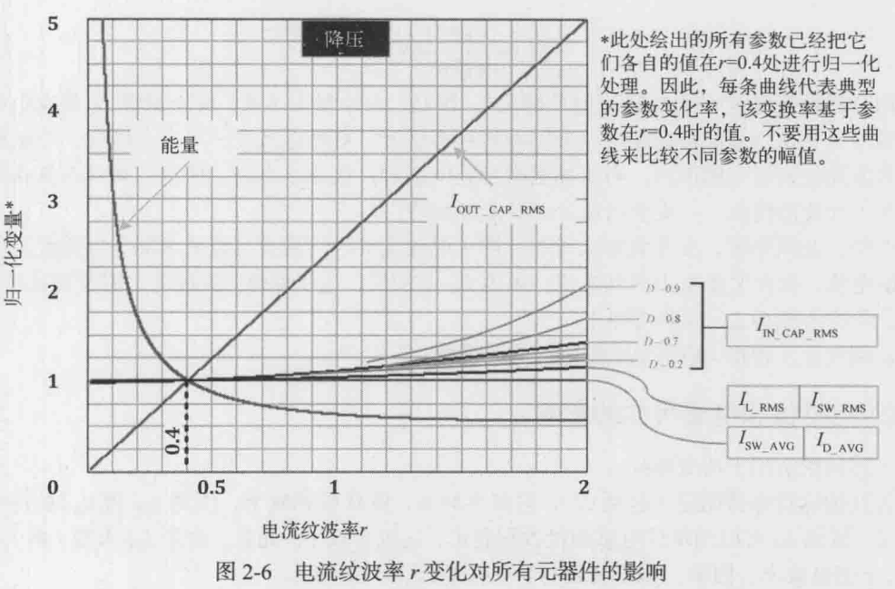
	- **就变换器的整体应力和尺寸而言，$ r \approx 0.4 $是最优值**。进行说明
		- 一般认为，电感尺寸与其能量处理能力成正比（稍后还会讨论气隙对尺寸的影响）。
		- 上图给出了能量$ E = \frac{1}{2} \times L \times I_{PK}^{2}$对$r$的函数曲线，图中曲线在0.4附近有个拐点。这表明如果r值远小于0.4，那么电感尺寸必然相当大。而在另一侧，若r值增加，电感尺寸却没有明显减小。事实上，当r值超过0.4后，通过增加r值来减小电感尺寸的效果就不明显了。
		- 如果增加r值超过0.4，电容电流的有效值显著增加，导致发热增加，就要被迫选择具有更低等效串联电阻和更低热阻的电容。
		- **虽然你图2-6是以降压拓扑为例，但其能量曲线部分适用于所有拓扑，。虽然其他拓扑的电容电流曲线可能与降压变换器并不一致，但也非常类似。所以，上述结论仍然适用**。
		- 概括来讲，电流纹波率取值0.4左右对所有拓扑、所有应用和所有开关频率而言都是一个良好的设计指标。

- 是电感尺寸还是电感值
	- r越小，电感需要的能量处理能力就越大，电感尺寸也越大。
	- 讨论可能使r较小的方法
		- 若工况确定，负载电流和输入/输出电压就能确定，从而$I_{DC}$也能确定。在这种情况下，唯一能使r值减小的方法就是$\Delta I$更小，但已知$\Delta I$是
			- $$ \Delta I = \frac{\text{伏秒积}}{\text{电感值}} \left(\text{V*S/H}\right) \tag{2.16} $$
		- 而且伏秒积确定（输入/输出电压确定）。因此，对于给定工况，唯一能使r值减小的方法就是增加电感值。由此可以断定，若选择的电感值大，则电感尺寸一定大。
		- **必须牢记，档负载电流增加（即工况改变）时，需要更大能量处理能力的，更大型的电感，但却需要更小的电感值。因为$I_{DC}$增加后，为了保持r值最优，需要同比增加$\Delta I$，为此，不得不减小L，而非增加L。**

- 频率对电感值和电感尺寸的影响
	- **下述讨论适用所有拓扑**
	- 若其他所有变量保持固定（包括D），只频率加倍，则伏秒积减半（因为$t_{ON}$和$t_{OFF}$的持续时间减半），又因为$I_{DC}$不变。
		- $$ r = \frac{\Delta I}{I_{DC}}  $$ 
		- $$ \Delta I = \frac{\text{伏秒积}}{\text{电感值}} \left(\text{V*S/H}\right) \tag{2.16} $$
		- 要想r保持不变，则$\Delta I$需要加倍，电感值需要减半。
	- 电感峰值不变（因为r不变，$I_{DC}$不变），能力处理需求为$ E = \frac{1}{2} \times L \times I_{PK}^{2}$，电感值减半，所以电感尺寸减半。
		- 一般认为电感尺寸与频率成反比。
		- 电感的电流应力与频率无关（因为峰值电流不变）。

- 负载电流对电感值和电感尺寸的影响
	- $I_{DC}$加倍，r值要保持，则电感值减半，峰值电流$I_{DC} \times (1+r/2)$加倍，能力处理需求$ E = \frac{1}{2} \times L \times I_{PK}^{2}$也加倍。故电感增大
	- 因此，一般认为电感尺寸与负载电流成正比。

- 电感标定
	- 电感的$I_{DC}$额定电流和$I_{RMS}$额定值一般定义为，规定温升（典型值为40-55°，取决于供应商）下电感允许通过的直流电流。
	- 额定值$I_{SAT}$表示电感在磁芯饱和前允许通过的最大电流，一般认为此时电感储能已接近可用极限。
	- **用大型磁芯一定影响成本，但多用些铜无所谓。**

- 在给定应用中需要考虑的电感电流额定值
	- 在离线应用中设计电感时，一般会默认饱和电流高于直流电流的额定值。但在低压DC-DC变换器设计中，一般倾向于让两者相等。
	- 一般而言，大多数低压（一般$V_{IN}$小于40V）应用仅根据最大负载电流选择电感。

- 电流限制的范围和容限
	- 标准步骤是按照电流纹波率大约为0.4来确定电感值，因为它大致上是变换器整体设计的最优值。但若设计集成开关管，尤其是那些内部设有（固定）电流限制的开关管，可能还附加有另外的限制。避免出现折返限流（输出电压减小）现象。无法保证最大输出功率。

- r值固定时，对连续导通模式的考虑（2.14.2）
	- 一开始进入断续导通模式时，电流纹波率为2。
	- 通过简单的几何计算可得，电路将在负载电流为最大负载电流的r/2倍时进入断续导通模式。
	- 省略计算得公式：
		- $$ I_{O} = \frac{1}{2} \times \frac{V_{O}}{L \times f} \left(\text{降压和升降压}\right) \tag{2.30} $$
		- $$ I_{O} = \frac{2}{27} \times \frac{V_{O}}{L \times f} \left(\text{升压}\right) \tag{2.32} $$
			- 在D=0.33时，升压变换器的r达到最大值。
		- 如果拓扑的$ I_{O} $大于以上公式的值，无论输入电压增至多高，变换器都将保持在连续导通模式运行。

- 使用低等效串联电阻的电容时，r值应设为大于0.4
	- 由于等效电阻非常效，这些电容允许流过的电流纹波（有效值）也很高，因此，无论何种应用，这些电容的尺寸都不再取决于纹波电流处理能力。现在，即使增加r值，实际上未必会使电容所占空间显著增加，但相比之下，增加r值却可以使电感尺寸明显减小。
	- 有新型电容（MLC或MLCC、聚合物电容）助阵，r值可以大于传统的最优值0.4，如偶尔可以增加到0.6-1（假设没有其他条件限值），这样能使变换器性能更趋完美，只要优势不被其他必须外加的大型电容（如纹波需要的更大的滤波电容）所抵消，就是值得考虑的。

- 设置r值以避免次谐波振荡
	- 为避免谐波不稳定性，需要保证谐波补偿量（单位为A/S）等于电感电流下降斜坡的一半或更多。**次谐波不稳定原则上仅在占空比大于50%时发生，也只有在连续导通模式下运行时，才会发生次谐波不稳定**。所以另一种避免次谐波不稳定的方法时让变换器在断续导通模式下运行。
	- 如果谐波补偿量由控制器决定，那么设计人员需要人为保证电感电流下降斜坡小于或等于斜坡补偿量的两倍，这实际决定了最小电感量。有时可能要把r值设置为小于最优值0.4，如控制芯片没有足够的内置斜坡补偿量时。通过对电流模式更详细的建模，可以得出下列最优方程，并找出（避免次谐波不稳定）所需的最小电感值：
		- $$ L \geqslant \frac{D-0.34}{\text{斜波补偿量}} \times V_{IN}\mu H \left(\text{降压}\right) \tag{2.38} $$
		- $$ L \geqslant \frac{D-0.34}{\text{斜波补偿量}} \times V_{O}\mu H \left(\text{升压}\right) \tag{2.39} $$
		- $$ L \geqslant \frac{D-0.34}{\text{斜波补偿量}} \times (V_{IN}-V_{O})\mu H \left(\text{升降压}\right) \tag{2.40} $$
		- 斜波补偿量的单位时$\frac {A}{\mu s}$
		- 对这些拓扑而言，若输入电压最大时占空比大于50%，且变换器工作在连续导通模式下，则必须进行上述计算。

- 使用$ L \times I $和负载缩放法快速选择电感
	- 可根据上述方法综合考虑确定r值，下面先介绍一种在给定应用条件下快速选择电感的方法。
		- 由电感方程$ V=L \frac{dI}{dt} $可推导出另一个有用的关系式，称作$ L \times I $方程
			- $$ (L \times I_{L}) = \frac{E_{t}}{r}  \left(\text{所有拓扑}\right) \tag{2.41} $$
		- 以文字表示为
			- $$ L \times I = \frac{\text{伏秒积}}{\text{电流纹波率}}  \left(\text{所有拓扑}\right) \tag{2.42} $$
			- 如果知道伏秒积，并且设置了r的目标值，就能计算出$ L \times I $。然后，如果知道I，就能计算L。
		- 由于$ L \times I $方程与拓扑、开关频率或特定输入/输出电压无关，可绘制其通用关系图。该图有助于快速选择电感值。
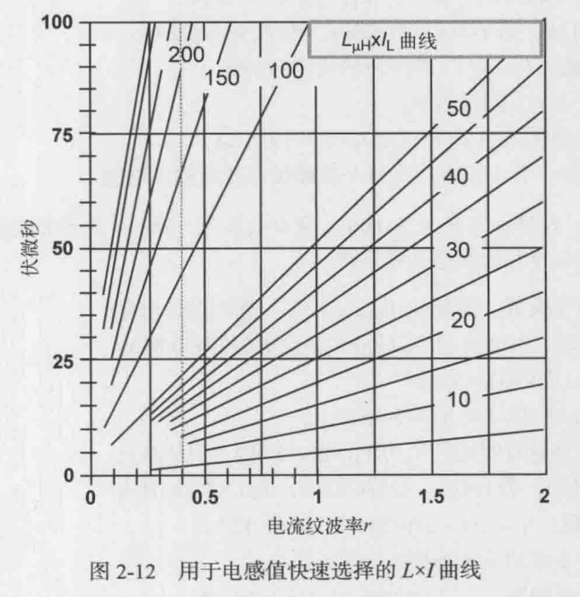

- 强迫连续导通模式下的电流纹波率r
	- 同步整流变换器，$ I_{DC} $减至零前一直保持在连续导通模式下运行，由于电流纹波$ \Delta I $仅取决于输入和输出电压，不妨假设它不变，于是电流纹波率$ r = \frac{\Delta I}{I_{DC}} $不仅可以大于2，事实上还可以变得更大。
	- 尽管现在r大于2，传统连续导通模式下推导的所有基本设计方程还是同样适用于强迫连续导通模式，包括输入输出电容和开关管的电流有效值，直流值，交流值或峰值（虽然此时会有一些额外损耗，例如电流流过主MOSFER体二极管时的损耗）。
	- 对于r无穷大的问题，可以用计算技巧来避免奇异点，假设最小负载电流为几个毫安，无论多小都可以。或者，把$ r = \frac{\Delta I}{I_{DC}} $代回方程中，使$ I_{DC} $被抵消掉（分母中不再出现）。

- 基本磁定义
	- H：磁场强度；B：磁通密度或磁感应强度
		- 磁通量(单位Wb）：
			- $$ \varnothing = \int_{s} BdS \left(\text{Wb}\right) \tag{2.43} $$
	- $$ \Delta B = \frac{L \times \Delta I}{NA}  \left(\text{电流型方程}\right) \tag{2.49} $$
		- $$ B = \frac{L \times I}{NA}  \left(\text{电流型方程}\right) \tag{2.51} $$
	- $$ \Delta B = \frac{V \times \Delta t}{NA}  \left(\text{电压型方程}\right) \tag{2.50} $$
		- $$ B_{AC} = \frac{V_{ON} \times D}{2 \times NAf}  \left(\text{电压型方程}\right) \tag{2.52} $$
	- N是匝数，A是流过磁通的表面面积

- 如果磁芯材料已经接近其储能极限，就不得不小心从事。多增加一些匝数就可能使磁芯“越界”（饱和）。此时，电感值实际上是暴跌，而不是增加。
	- 功率变换中电感设计的基本前提是：在给定应用中，电感值越大，电感尺寸越大。所以，只增加匝数却不增加尺寸，结果是灾难性的。

- 最大磁芯损耗
	- 一般来说，磁芯损耗仅占总损耗的很小一部分，不必太在意，甚至没有必要进行数值计算。

- 最大二极管损耗
	- 平均二极管电流的一般表达式为
		- $$ I_{D\_AVG} = I_{L} \times (1-D) \left(\text{所有拓扑}\right) \tag{2.98} $$
		- 或者写作
			- $$ I_{D\_AVG} = I_{O} \times (1-D) \left(\text{降压}\right) \tag{2.99} $$
			- $$ I_{D\_AVG} = I_{O}  \left(\text{升压和升降压}\right) \tag{2.100} $$
		- 由此导致的二极管损耗为
			- $$ P_{D} = V_{D} \times I_{D}= V_{D} \times I_{O} \times (1-D) \left(\text{降压}\right) \tag{2.101} $$
			- $$ P_{D} = V_{D} \times I_{D}= V_{D} \times I_{O}  \left(\text{升压和升降压}\right) \tag{2.102} $$

- 最大开关损耗
	- 对于所有拓扑而言，输入电压减小时，平均输入电流（和开关管电流）必然增加，以满足基本的功率需求，即$ P_{IN} = V_{IN} \times I_{IN} = \frac{P_{O}}{\Eta} $.因此，所有拓扑的开光有效值电流在$ V_{INMIN} $即（$ D_{MAX} $)处最大。
	- 通过下述方程，可以计算开关管有效值电流：
		- $$ I_{RMS\_SW} = I_{L\_DMAX} \times \sqrt{D_{DMAX} \times (1 +  \frac{r_{DMAX}^{2} }{12})}  \left(\text{所有拓}\right) \tag{2.104} $$
		- 式中$ L\_DMAX $和$ r_{DMAX} $分别是$ D_{DMAX} $（即$ V_{INMIN} $）处的平均电感电流和电流纹波率。$ D_{DMAX} $可用下式计算
			- $$ D_{DMAX} = \frac{V_{O}-V_{INMIN}+V_{D}}{V_{O}-V_{SW}+V_{D}}  \left(\text{升压}\right) \tag{2.105} $$
			- $$ D_{DMAX} = \frac{V_{O}+V_{D}}{V_{INMIN}+V_{O}-V_{SW}+V_{D}}  \left(\text{升降压}\right) \tag{2.106} $$
				- 切记
					- $$ I_{L\_DMAX} = \frac{I_{O}}{1-D_{DMAX}}  \left(\text{升压和升降压}\right) \tag{2.107} $$
	- 对于降压变换器，一般电感设计步骤从$ D_{MIN} $开始，所以不能直接使用（一般电感设计步骤）计算的开关管有效值电流。这需要计算$r_{DMAX}$，但迄今为止，仅已知$r_{DMIN}$。继续以下计算步骤。
		- $$ r_{DMAX} = \frac{Et_{DMAX}}{L \times I_{L}}  \left(\text{所有拓扑}\right) \tag{2.108} $$
	- 换句话说，如果已知$ V_{INMIN} $处的伏秒积，就可以知道所选电感相应的电流纹波率$ r_{DMAX} $。但首先不得不计算$ D_{MAX} $
		- $$ D_{DMAX} = \frac{V_{O}+V_{D}}{V_{INMIN}-V_{SW}+V_{D}}  \left(\text{降压}\right) \tag{2.109} $$
		- 开关管导通时间为
			- $$ t_{ON\_DMAX} = \frac{D_{MAX}}{f} \left(\text{所有拓扑}\right) \tag{2.110} $$
		- 当开关管导通时，电感两端的电压为
			- $$ V_{ON\_DMAX} = V_{INMIN}-V_{SW}-V_{O} \left(\text{降压}\right) \tag{2.111} $$
		- 因此，伏微妙积为
			- $$ Et_{DMAX} = V_{ON\_DMAX} \times t_{ON\_DMAX} \left(\text{所有拓扑}\right) \tag{2.112} $$
		- 所以
			- r_{DMAX} = \frac{Et_{DMAX}}{L \times I_{O}} \left(\text{降压}\right) \tag{2.113} $$
		- 终于能够计算开关损耗
			- $$ I_{RMS\_SW} = I_{L\_DMAX} \times \sqrt{D_{DMAX} \times (1 +  \frac{r_{DMAX}^{2} }{12})}  \left(\text{所有拓}\right) \tag{2.114} $$
			- 若漏源电阻为$ R_{DS} $，则MOSFET的开关损耗为
				- $$ P_{SW} = I_{RMS\_SW}^{2} \times R_{DS}  \left(\text{所有拓}\right) \tag{2.115} $$

- 最大输出电容损耗
	- 对于上述三种拓扑，其输出电容的最大有效值电流恰好都对应同一电压，而且该电压就是一般电感设计步骤中采用的电压值。
		- 对于降压变换器，可得
			- $$ I_{RMS\_OUT} = I_{O} \times \frac{r_{DMIN}}{\sqrt{12}} = 1 \times \frac{0.277}{\sqrt{12}} = 0.08 A \left(\text{降压}\right) \tag{2.116} $$
		- 如果输出电容的等效串联电阻（ESR）为10Ω，则功耗为
			- $$ P_{SW} = I_{RMS\_OUT}^2 \times ESR = 0.08^2 \times 10 = 0.064 W \left(\text{所有拓扑}\right) \tag{2.117} $$
		- 对于升压和升降压变换器，需要使用
			- $$ I_{RMS\_OUT} = I_{O} \times \sqrt{\frac{D_{MAX} + (r_{DMAX}^2 / 12)}{1 - D_{MAX}}} \left(\text{升压和升降压}\right) \tag{2.118} $$

- 最大输入电容损耗
	- 对于升降压变换器，输入电容的最大有效值电流出现在$ D_{MAX} $，因此可得：
		- $$ I_{RMS\_IN} = I_{L\_DMAX} \times \sqrt{D_{MAX} \times (1- D_{MAX} + \frac{r_{DMAX}^2}{12})} \left(\text{升降压}\right) \tag{2.119} $$
	- 对于降压和升压变换器，输入电容的最大有效值电流出现在D=0.5时，因此不得不计算$ r_{50} $，即D=50%时的电流纹波率
		- 对于降压变换器，D=50%时的输入电压为
			- $$ V_{IN\_50} = 2 \times V_{O} + V_{SW} + V_{D} = 2 \times 12 + 1.5 + 0.5 = 26V \left(\text{降压}\right) \tag{2.120} $$
		- 对于升压变换器，为
			- $$ V_{IN\_50} = \frac{V_{O} + V_{SW} + V_{D}}{2}  \approx \frac{V_{O}}{2} \left(\text{升压}\right) \tag{2.121} $$
	- 该点并未包含在输入电压范围内，但最接近的时$ V_{INMAX} $。因此，可以使用该设计步骤计算的数值，并通过下属方程计算输入电容的有效值电流：
		- $$ I_{RMS\_IN} = I_{O} \times \sqrt{D \times (1- D + \frac{r^2}{12})} = 1 \times \sqrt{0.543 \times (1- 0.543 + \frac{0.277^2}{12})} \left(\text{降压}\right) \tag{2.122} $$
		- $$ I_{RMS\_IN} = \frac{I_{O}}{1 - D} \times \frac{r}{\sqrt{12}} \left(\text{升压}\right) \tag{2.123} $$
